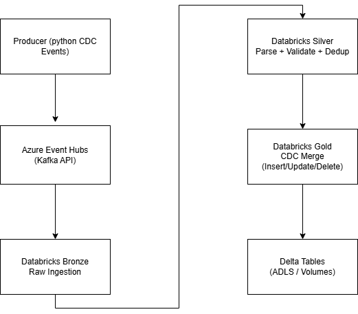
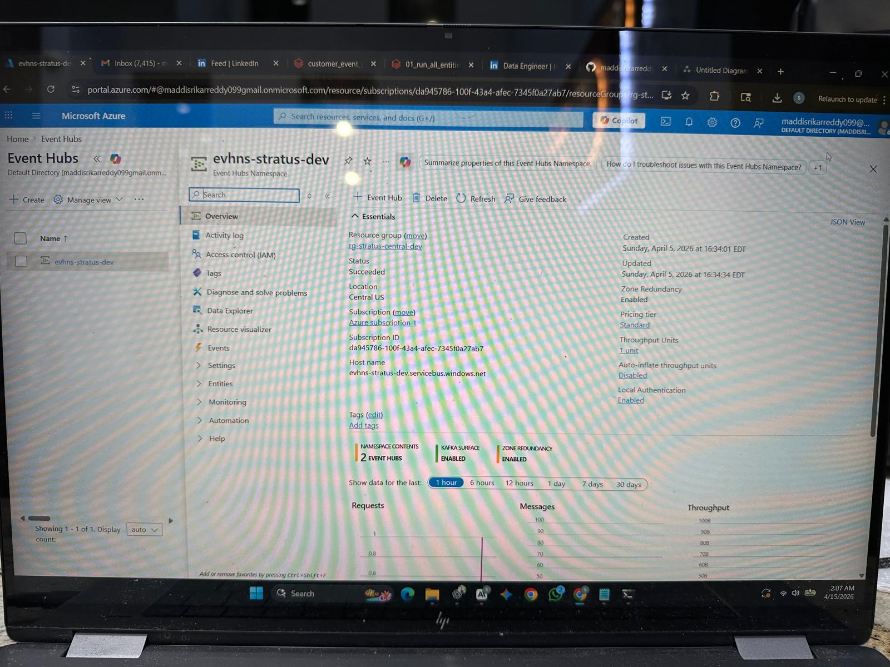
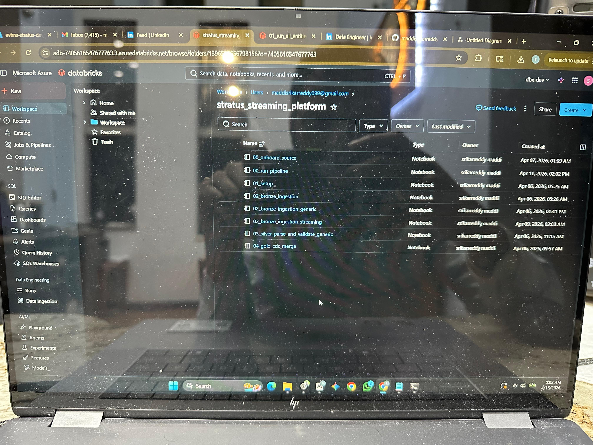
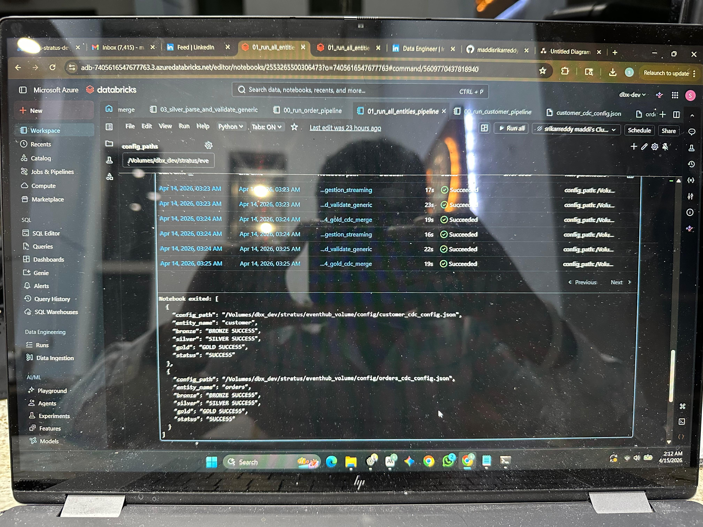
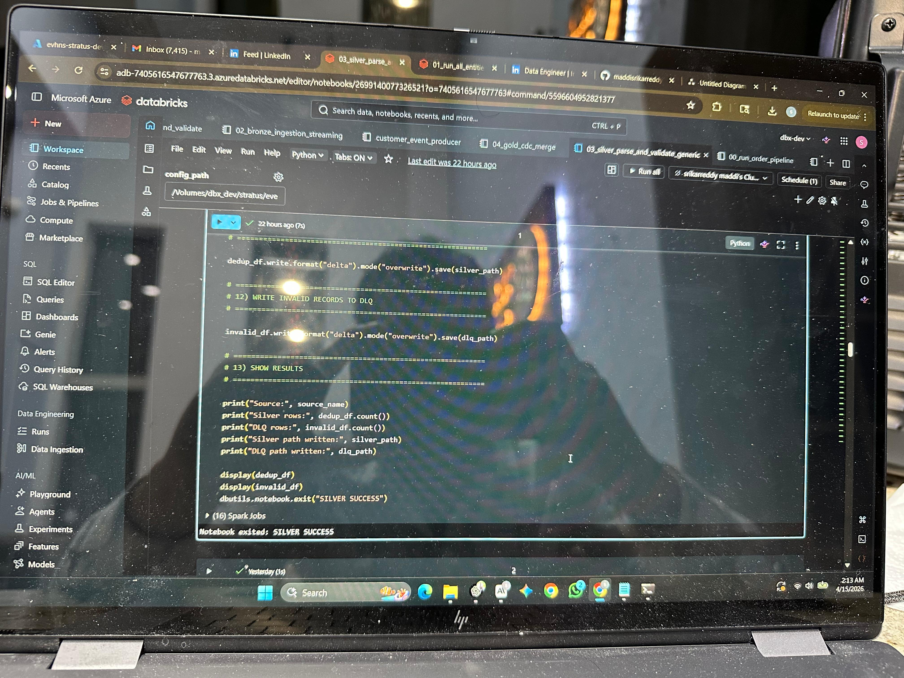
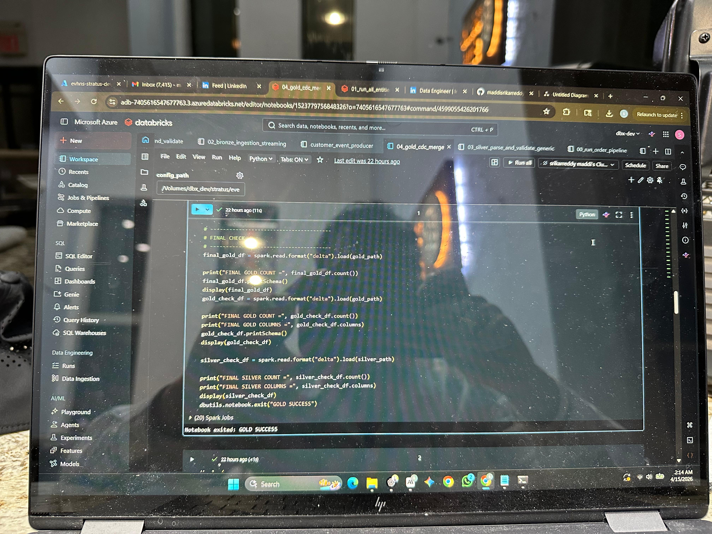

# Stratus Self-Service Streaming Platform (Azure)

## Overview
Implemented a config-driven self-service streaming ingestion platform on Azure using Azure Event Hubs, Azure Databricks, and Delta Lake. The platform processes CDC events across multiple entities using Bronze, Silver, and Gold layers.

## Architecture

## Tech Stack
- Azure Event Hubs (Kafka API)
- Azure Databricks
- PySpark
- Spark Structured Streaming
- Delta Lake
- ADLS Gen2 / Databricks Volumes
- Python

## Pipeline Flow
Producer → Azure Event Hubs → Bronze → Silver → Gold

## Implemented Entities
- customer
- orders

## Features
- Config-driven onboarding for new entities
- Bronze raw ingestion from Event Hubs
- Silver parsing, validation, and deduplication
- Gold CDC merge handling for insert, update, and delete
- Multi-entity orchestration using reusable Databricks notebooks

## Azure and Databricks Proof

### Azure Event Hubs

### Databricks Workspace

### Orchestration Success

### Silver Delete Proof

### Gold Delete Proof

## Project Structure
- `notebooks/` → Databricks pipeline notebooks
- `configs/` → entity-specific JSON configs
- `producer/` → test event producer scripts
- `architecture/` → architecture diagram and execution proof screenshots

## Result
Validated end-to-end CDC processing on Azure Databricks with Bronze, Silver, and Gold layers for multiple entities.